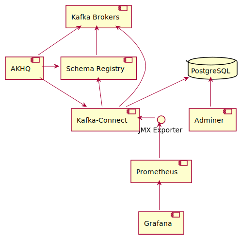
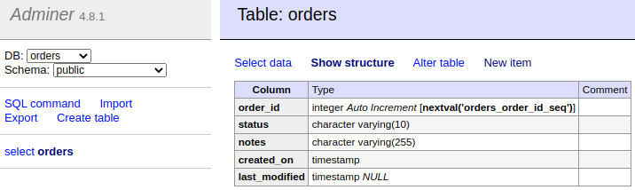
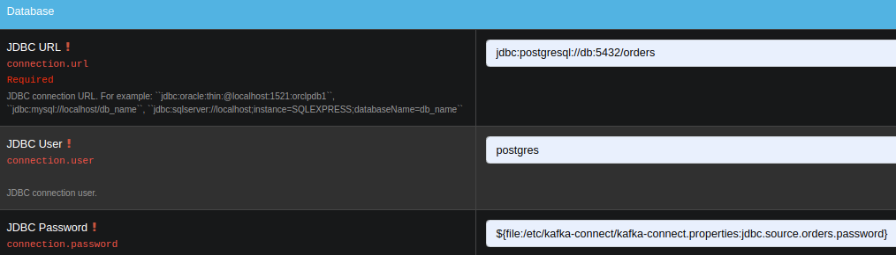
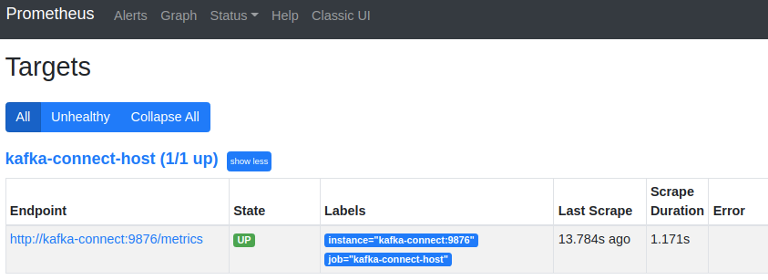
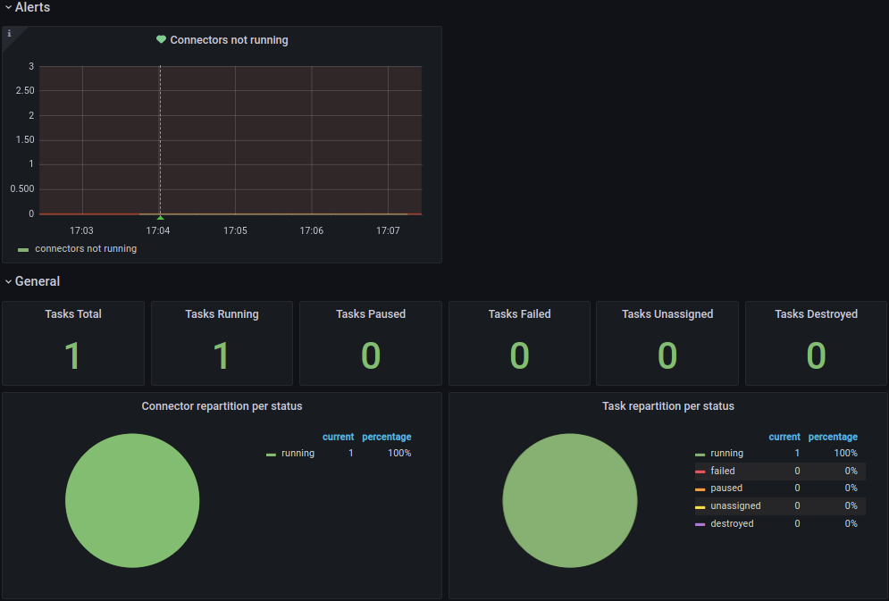

# Production ready Kafka Connect

Kafka Connect is a great tool for https://docs.confluent.io/platform/6.2.1/connect/index.html[streaming data between your Apache Kafka cluster and other data systems].
Getting started with with Kafka Connect is fairly easy; there's https://www.confluent.io/hub/[hunderds of connectors avalable] to intregrate with data stores, cloud platfoms, other messaging systems and monitoring tools.
Setting up a production grade installation is slightly more involved however, with documentation at times scattered across the web.

In this post we'll set up a complete production grade Kafka Connect installation, highlighting some of the choices and configuration quirks along the way.

For illustrative purposes we will set up a https://www.confluent.io/hub/confluentinc/kafka-connect-jdbc[JDBC source connector] that publishes any new table rows onto a Kafka Topic, but you can substitute any other source or sink connector.

We will set up:

1. a Postgres database, with an orders table
    - with https://www.adminer.org/[Adminer] to create new rows
2. a local Kafka cluster using Docker Compose
    - with Confluent Schema Registry to support Avro (de)serialization
3. a Kafka Connect instance, in distributed mode
    - with AKHQ to more easily create and manage connectors
4. a source connector from the Postgres table to a Kafka topic
    - with database connection password as environment variable
5. JMX metrics exported and scraped by Prometheus for monitoring
6. a Grafana dashboard to visualize & alert Connector status

.Overview of interactions between components

https://github.com/timtebeek/production-ready-kafka-connect[All configuration is available on GitHub].

== Set up Postgres database

We will use a https://hub.docker.com/_/postgres[plain Postgres Docker image],
with a database initialization script to quickly create our desired table with some rows.

.Postgres Dockerfile with initialization script
[source,Dockerfile]
----
FROM postgres:13-alpine
ADD create-table.sql /docker-entrypoint-initdb.d/
----

.Initialization script to create order table with two rows
[source,sql]
----
CREATE TABLE orders (
	order_id SERIAL PRIMARY KEY,
	status VARCHAR(10) NOT NULL,
	notes VARCHAR(255) NOT NULL,
	created_on TIMESTAMP NOT NULL,
	last_modified TIMESTAMP
);

INSERT INTO "orders"
	("order_id", "status", "notes", "created_on", "last_modified")
VALUES
	(1, 'PENDING', '', now(), NULL),
	(2, 'ACCEPTED', 'Some notes', now(), now());
----

.Docker Compose instructions for Postgres
[source,yaml]
----
  db:
    build:
      context: ./db
    ports:
    - 5432:5432
    environment:
    - POSTGRES_DB=orders
    - POSTGRES_USER=postgres
    - POSTGRES_PASSWORD=password
----

=== Adminer

We set up https://www.adminer.org/[Adminer] to easily view, edit and create new table rows.

.Docker Compose instructions for Adminer
[source,yaml]
----
  # http://localhost:8082/?pgsql=db&username=postgres&db=orders&ns=public
  adminer:
    image: adminer:4.8.1
    restart: always
    ports:
      - 8082:8080
    links:
      - db
----

Once up and running you will see the following table.

.Adminer interface

== Set up local Kafka Cluster

Next up we need a local Kafka Cluster. For simplicity we will use a single node cluster, without SSL.

.Docker Compose instructions for ZooKeeper and Kafka
[source,yaml]
----
  zookeeper:
    image: confluentinc/cp-zookeeper:6.2.1
    volumes:
      - zookeeper-data:/var/lib/zookeeper/data:Z
      - zookeeper-log:/var/lib/zookeeper/log:Z
    environment:
      ZOOKEEPER_CLIENT_PORT: '2181'
      ZOOKEEPER_ADMIN_ENABLE_SERVER: 'false'

  kafka:
    image: confluentinc/cp-kafka:6.2.1
    volumes:
      - kafka-data:/var/lib/kafka/data:Z
    ports:
      - 9091:9091
    environment:
      KAFKA_BROKER_ID: '0'
      KAFKA_ZOOKEEPER_CONNECT: 'zookeeper:2181'
      KAFKA_NUM_PARTITIONS: '12'
      KAFKA_COMPRESSION_TYPE: 'gzip'
      KAFKA_OFFSETS_TOPIC_REPLICATION_FACTOR: '1'
      KAFKA_TRANSACTION_STATE_LOG_REPLICATION_FACTOR: '1'
      KAFKA_TRANSACTION_STATE_LOG_MIN_ISR: '1'
      KAFKA_ADVERTISED_LISTENERS: 'PLAINTEXT://kafka:9092'
      KAFKA_CONFLUENT_SUPPORT_METRICS_ENABLE: 'false'
      KAFKA_JMX_PORT: '9091'
      KAFKA_AUTO_CREATE_TOPICS_ENABLE: 'true'
      KAFKA_AUTHORIZER_CLASS_NAME: 'kafka.security.auth.SimpleAclAuthorizer'
      KAFKA_ALLOW_EVERYONE_IF_NO_ACL_FOUND: 'true'
    links:
      - zookeeper
----

=== Confluent Schema Registry

We also set up https://docs.confluent.io/platform/6.2.1/schema-registry/index.html[Confluent Schema Registry], as it provides a nice way to ensure compatibility between producers and consumers over time.

.Docker Compose instructions for Confluent Schema Registry
[source,yaml]
----
  schema-registry:
    image: confluentinc/cp-schema-registry:6.2.1
    depends_on:
      - kafka
    ports:
      - 8081:8081
    environment:
      SCHEMA_REGISTRY_KAFKASTORE_BOOTSTRAP_SERVERS: 'PLAINTEXT://kafka:9092'
      SCHEMA_REGISTRY_HOST_NAME: 'schema-registry'
      SCHEMA_REGISTRY_LISTENERS: 'http://0.0.0.0:8081'
      SCHEMA_REGISTRY_LOG4J_ROOT_LOGLEVEL: 'INFO'
----

== Kafka Connect instance

With Postgres and Kafka running, we can now focus on setting up our Kafka Connect instance.
To reiterate we have a few goals in setting up Kafka Connect:

1. https://docs.confluent.io/platform/6.2.1/connect/userguide.html#standalone-vs-distributed-mode[Run in distributed mode, as it's fault tolerant]
2. https://docs.confluent.io/platform/6.2.1/connect/userguide.html#configuring-key-and-value-converters[Use Confluent Schema Registry in message (de)serialization]
3. Manage connectors through https://akhq.io/[AKHQ]

Running in distributed mode is easy; it's the default when running the Docker image, and need only be changed if you're running a single agent, for instance to send web server logs to Kafka.

We also need a few minor tweaks to the configuration to be able to work with our local single node cluster.
On a production deployment you'd typically want to raise the replication factor to better match your Kafka cluster.

.(Partial) Docker Compose instructions for Kafka Connect
[source,yaml]
----
  kafka-connect:
    build:
      context: ./kafka-connect
    ports:
      - 8083:8083
      - 9875:9875
      - 9876:9876
    depends_on:
      - schema-registry
      - db
    environment:
      CONNECT_BOOTSTRAP_SERVERS: 'kafka:9092'
      CONNECT_GROUP_ID: 'kafka-connect'
      CONNECT_REST_ADVERTISED_HOST_NAME: 'localhost'
      CONNECT_CONFIG_STORAGE_REPLICATION_FACTOR: 1
      CONNECT_OFFSET_STORAGE_REPLICATION_FACTOR: 1
      CONNECT_STATUS_STORAGE_REPLICATION_FACTOR: 1
      CONNECT_CONFIG_STORAGE_TOPIC: 'connect-config-storage'
      CONNECT_OFFSET_STORAGE_TOPIC: 'connect-offset-storage'
      CONNECT_STATUS_STORAGE_TOPIC: 'connect-status-storage'
      CONNECT_INTERNAL_KEY_CONVERTER: 'org.apache.kafka.connect.json.JsonConverter'
      CONNECT_INTERNAL_VALUE_CONVERTER: 'org.apache.kafka.connect.json.JsonConverter'
----

Notice how all the environment variables share a common `CONNECT_` prefix.
Any such prefixed environment variables are 
https://docs.confluent.io/platform/6.2.1/installation/docker/config-reference.html#kconnect-long-configuration[converted according to a specific rule set], and made available to Kafka Connect.

To (de)serialize messages using Avro by default, we add the following environment variables.

.(Partial) Docker Compose instructions for Kafka Connect
[source,yaml]
----
      # Default converter configuration
      CONNECT_KEY_CONVERTER: 'org.apache.kafka.connect.storage.StringConverter'
      CONNECT_VALUE_CONVERTER: 'io.confluent.connect.avro.AvroConverter'
      CONNECT_VALUE_CONVERTER_SCHEMA_REGISTRY_URL: 'http://schema-registry:8081/'
----

While we won't cover SSL configuration in depth here, it's helpful to note there can be quite a bit of repetition involved when connecting to an SSL secured Kafka Cluster.
Configuration is separate for the tool itself, storage of config, offset and status, as well as for consumers and producers.
Taken all together you end up with something similar to these environment variables.

.SSL Environment variables example
[%collapsible]
====
[source,yaml]
----
CONNECT_SECURITY_PROTOCOL: 'SSL'
CONNECT_SSL_KEY_PASSWORD: ''password'
CONNECT_SSL_KEYSTORE_LOCATION: '/etc/confluent/keystore.jks'
CONNECT_SSL_KEYSTORE_PASSWORD: ''password'
CONNECT_SSL_TRUSTSTORE_LOCATION: '/etc/confluent/truststore.jks'
CONNECT_SSL_TRUSTSTORE_PASSWORD: ''password'

CONNECT_KAFKASTORE_SECURITY_PROTOCOL: 'SSL'
CONNECT_KAFKASTORE_SSL_KEY_PASSWORD: ''password'
CONNECT_KAFKASTORE_SSL_KEYSTORE_LOCATION: '/etc/confluent/keystore.jks'
CONNECT_KAFKASTORE_SSL_KEYSTORE_PASSWORD: ''password'
CONNECT_KAFKASTORE_SSL_TRUSTSTORE_LOCATION: '/etc/confluent/truststore.jks'
CONNECT_KAFKASTORE_SSL_TRUSTSTORE_PASSWORD: ''password'

CONNECT_PRODUCER_SECURITY_PROTOCOL: 'SSL'
CONNECT_PRODUCER_SSL_KEY_PASSWORD: ''password'
CONNECT_PRODUCER_SSL_KEYSTORE_LOCATION: '/etc/confluent/keystore.jks'
CONNECT_PRODUCER_SSL_KEYSTORE_PASSWORD: ''password'
CONNECT_PRODUCER_SSL_TRUSTSTORE_LOCATION: '/etc/confluent/truststore.jks'
CONNECT_PRODUCER_SSL_TRUSTSTORE_PASSWORD: ''password'

CONNECT_CONSUMER_SECURITY_PROTOCOL: 'SSL'
CONNECT_CONSUMER_SSL_KEY_PASSWORD: ''password'
CONNECT_CONSUMER_SSL_KEYSTORE_LOCATION: '/etc/confluent/keystore.jks'
CONNECT_CONSUMER_SSL_KEYSTORE_PASSWORD: ''password'
CONNECT_CONSUMER_SSL_TRUSTSTORE_LOCATION: '/etc/confluent/truststore.jks'
CONNECT_CONSUMER_SSL_TRUSTSTORE_PASSWORD: ''password'
----
====

=== AKHQ

https://akhq.io/[AKHQ] is an adminstrative tool to explore and manage your topics, consumer groups, Schema Registry, Kafka Connect and more.

.Docker Compose instructions for AKHQ
[source,yaml]
----
  akhq:
    image: tchiotludo/akhq:0.18.0
    environment:
      AKHQ_CONFIGURATION: |
        akhq:
          connections:
            docker-kafka-server:
              properties:
                bootstrap.servers: 'kafka:9092'
              schema-registry:
                url: 'http://schema-registry:8081'
              connect:
                - name: "connect"
                  url: "http://kafka-connect:8083/"
    ports:
      - 8080:8080
    links:
      - kafka
      - schema-registry
      - kafka-connect
----

Once configured you get a web interface that allows you to easily add new connectors via: +
http://localhost:8080/ui/docker-kafka-server/connect/connect/create

== JDBC Source Connector

Connectors can easily be installed through https://www.confluent.io/hub/[the Connector Hub].
We add both the https://www.confluent.io/hub/confluentinc/kafka-connect-avro-converter[Avro Converter]
and https://www.confluent.io/hub/confluentinc/kafka-connect-jdbc[JDBC Source/Sink] plugins to our Docker image.

.(Partial) Dockerfile for Kafka Connect with plugins
[source,Dockerfile]
----
FROM confluentinc/cp-kafka-connect-base:6.2.1

# Install Avro & JDBC plugins
RUN confluent-hub install --no-prompt confluentinc/kafka-connect-avro-converter:5.5.4
RUN confluent-hub install --no-prompt confluentinc/kafka-connect-jdbc:10.1.1
----

Once all the above is up and running we're ready to create our new JDBC Source connector to produce database records onto Kafka.

1. http://localhost:8080/ui/docker-kafka-server/connect/connect/create[Open the local AKHQ URL to create a new connector].
2. Select the `io.confluent.connect.jdbc.JdbcSourceConnector`
3. Match the following property values to the input fields

.JDBC Source Connector properties
[source,properties]
----
name=jdbc-source-orders
connector.class=io.confluent.connect.jdbc.JdbcSourceConnector
connection.url=jdbc:postgresql://db:5432/orders
connection.user=postgres
connection.password=${file:/etc/kafka-connect/kafka-connect.properties:jdbc.source.orders.password}
incrementing.column.name=order_id
mode=incrementing
table.whitelist=orders
topic.prefix=connect.
transforms=createKeyStruct,extractStructValue,addNamespace
----

.Partial view of the Create a definition form

Notice how the input form is generated and provides you with details on most configuration options.
Depending on your use case you might want to vary the `Table Loading Mode` as well as the applied `transforms`.

=== Transforms

https://docs.confluent.io/platform/6.2.1/connect/transforms/overview.html[Single Message Transformations] allow you to make quick changes to the messages created before they are published onto Kafka.
Quite a few transformations are already available by default, and we'll apply a couple to set our record key as a primitive, as well as set the schema name for our Avro values. 

Notice how each of the ordered transformations configured under JDBC Source Connector properties are reflected below.

.Individual transformation configuration for `transforms = createKeyStruct,extractStructValue,addNamespace`
[source,json]
----
{
    // Extract order_id column value as record key primitive
    "transforms.createKeyStruct.fields": "order_id",
    "transforms.createKeyStruct.type": "org.apache.kafka.connect.transforms.ValueToKey",
    "transforms.extractStructValue.field": "order_id",
    "transforms.extractStructValue.type": "org.apache.kafka.connect.transforms.ExtractField$Key",
    // Set the Avro schema name for record value
    "transforms.addNamespace.schema.name": "connect.Order",
    "transforms.addNamespace.type": "org.apache.kafka.connect.transforms.SetSchemaMetadata$Value"
}
----

=== Secrets

As outlined at the start of this post, we do not want to store our Connector secrets as plain text in our Connector configuration.
Luckily 
https://docs.confluent.io/platform/6.2.1/connect/userguide.html#configprovider-interface[Kafka Connect contains a ConfigProvider Interface] which enables us to store our secrets separately and in a secure way.

With the following environment variables added to our Kafka Connect instance, we enable the `FileConfigProvider`,
which can read secret values from a file within the Docker image.

.(Partial) Docker Compose instructions for Kafka Connect
[source,yaml]
----
      # Read connection password from file
      CONNECT_CONFIG_PROVIDERS: "file"
      CONNECT_CONFIG_PROVIDERS_FILE_CLASS: "org.apache.kafka.common.config.provider.FileConfigProvider"
      # Store connection password in /etc/kafka-connect/kafka-connect.properties
      CONNECT_JDBC_SOURCE_ORDERS_PASSWORD: password
----

Notice how the last environment combines with the Docker image propensity to write `CONNECT_` prefixed environment variables to a local file,
https://docs.confluent.io/platform/6.2.1/installation/docker/config-reference.html#kconnect-long-configuration[following the aformentioned rule set].

That enables us to refer to the value of the environment variable in our Connector config using the `${file:_filename_:_property_}` style.

.JDBC Source Connector properties
[source,properties]
----
connection.password=${file:/etc/kafka-connect/kafka-connect.properties:jdbc.source.orders.password}
----

=== Create connector
Once created your connector should immediately became active and push records onto Kafka.
After that, you can once again use AKHQ to explore the create topic, messages and Avro schema.

The Avro schema can optionally be https://docs.confluent.io/platform/6.2.1/schema-registry/develop/maven-plugin.html[downloaded through the Schema Registry Maven Plugin] to create https://github.com/timtebeek/register-avro-schemas[compiled classes you can use in your applications].

== JMX metrics exporter

With our services and connector up and running, we want to be ensure the connector remains active, or be alerted if there are any issues.
To this end we add the https://github.com/prometheus/jmx_exporter[Prometheus JMX Exporter agent] to our Kafka Connect image,
as that's unfortunately https://github.com/confluentinc/kafka-images/issues/31[not yet available by default].

.(Partial) Dockerfile for Kafka Connect with JMX exporter
[source,Dockerfile]
----
# Install and configure JMX Exporter
COPY jmx_prometheus_javaagent-0.15.0.jar /opt/
COPY kafka-connect.yml /opt/
----

.(Partial) Docker Compose instructions for Kafka Connect
[source,yaml]
----
      # Export JMX metrics to :9876/metrics for Prometheus
      KAFKA_JMX_PORT: '9875'
      KAFKA_OPTS: "-javaagent:/opt/jmx_prometheus_javaagent-0.15.0.jar=9876:/opt/kafka-connect.yml"
----

Now helpfully, the JMX Exporter comes with a https://github.com/prometheus/jmx_exporter/blob/parent-0.15.0/example_configs/kafka-connect.yml[bespoke configuration file for Kafka Connect].

.Show JMX Exporter configuration for Kafka Connect 
[%collapsible]
====
.kafka-connect.yml
[source,yaml]
----
lowercaseOutputName: true
rules:
  #kafka.connect:type=app-info,client-id="{clientid}"
  #kafka.consumer:type=app-info,client-id="{clientid}"
  #kafka.producer:type=app-info,client-id="{clientid}"
  - pattern: 'kafka.(.+)<type=app-info, client-id=(.+)><>start-time-ms'
    name: kafka_$1_start_time_seconds
    labels:
      clientId: "$2"
    help: "Kafka $1 JMX metric start time seconds"
    type: GAUGE
    valueFactor: 0.001 
  - pattern: 'kafka.(.+)<type=app-info, client-id=(.+)><>(commit-id|version): (.+)'
    name: kafka_$1_$3_info
    value: 1
    labels:
      clientId: "$2"
      $3: "$4"
    help: "Kafka $1 JMX metric info version and commit-id"
    type: GAUGE

  #kafka.producer:type=producer-topic-metrics,client-id="{clientid}",topic="{topic}"", partition="{partition}"
  #kafka.consumer:type=consumer-fetch-manager-metrics,client-id="{clientid}",topic="{topic}"", partition="{partition}"
  - pattern: kafka.(.+)<type=(.+)-metrics, client-id=(.+), topic=(.+), partition=(.+)><>(.+-total|.+-rate|.+-avg|.+-replica|.+-lag|.+-lead)
    name: kafka_$2_$6
    labels:
      clientId: "$3"
      topic: "$4"
      partition: "$5"
    help: "Kafka $1 JMX metric type $2"
    type: GAUGE

  #kafka.producer:type=producer-topic-metrics,client-id="{clientid}",topic="{topic}"
  #kafka.consumer:type=consumer-fetch-manager-metrics,client-id="{clientid}",topic="{topic}"", partition="{partition}"
  - pattern: kafka.(.+)<type=(.+)-metrics, client-id=(.+), topic=(.+)><>(.+-total|.+-rate|.+-avg)
    name: kafka_$2_$5
    labels:
      clientId: "$3"
      topic: "$4"
    help: "Kafka $1 JMX metric type $2"
    type: GAUGE

  #kafka.connect:type=connect-node-metrics,client-id="{clientid}",node-id="{nodeid}"
  #kafka.consumer:type=consumer-node-metrics,client-id=consumer-1,node-id="{nodeid}"
  - pattern: kafka.(.+)<type=(.+)-metrics, client-id=(.+), node-id=(.+)><>(.+-total|.+-avg)
    name: kafka_$2_$5
    labels:
      clientId: "$3"
      nodeId: "$4"
    help: "Kafka $1 JMX metric type $2"
    type: UNTYPED

  #kafka.connect:type=kafka-metrics-count,client-id="{clientid}"
  #kafka.consumer:type=consumer-fetch-manager-metrics,client-id="{clientid}"
  #kafka.consumer:type=consumer-coordinator-metrics,client-id="{clientid}"
  #kafka.consumer:type=consumer-metrics,client-id="{clientid}"
  - pattern: kafka.(.+)<type=(.+)-metrics, client-id=(.*)><>(.+-total|.+-avg|.+-bytes|.+-count|.+-ratio|.+-rate|.+-age|.+-flight|.+-threads|.+-connectors|.+-tasks|.+-ago)
    name: kafka_$2_$4
    labels:
      clientId: "$3"
    help: "Kafka $1 JMX metric type $2"
    type: GAUGE

  #kafka.connect:type=connector-task-metrics,connector="{connector}",task="{task}<> status"
  - pattern: 'kafka.connect<type=connector-task-metrics, connector=(.+), task=(.+)><>status: ([a-z-]+)'
    name: kafka_connect_connector_status
    value: 1
    labels:
      connector: "$1"
      task: "$2"
      status: "$3"
    help: "Kafka Connect JMX Connector status"
    type: GAUGE

  #kafka.connect:type=task-error-metrics,connector="{connector}",task="{task}"
  #kafka.connect:type=source-task-metrics,connector="{connector}",task="{task}"
  #kafka.connect:type=sink-task-metrics,connector="{connector}",task="{task}"
  #kafka.connect:type=connector-task-metrics,connector="{connector}",task="{task}"
  - pattern: kafka.connect<type=(.+)-metrics, connector=(.+), task=(.+)><>(.+-total|.+-count|.+-ms|.+-ratio|.+-rate|.+-avg|.+-failures|.+-requests|.+-timestamp|.+-logged|.+-errors|.+-retries|.+-skipped)
    name: kafka_connect_$1_$4
    labels:
      connector: "$2"
      task: "$3"
    help: "Kafka Connect JMX metric type $1"
    type: GAUGE

  #kafka.connect:type=connector-metrics,connector="{connector}"
  #kafka.connect:type=connect-worker-metrics,connector="{connector}"
  - pattern: kafka.connect<type=connect-worker-metrics, connector=(.+)><>([a-z-]+)
    name: kafka_connect_worker_$2
    labels:
      connector: "$1"
    help: "Kafka Connect JMX metric $1"
    type: GAUGE

  #kafka.connect:type=connect-worker-metrics
  - pattern: kafka.connect<type=connect-worker-metrics><>([a-z-]+)
    name: kafka_connect_worker_$1
    help: "Kafka Connect JMX metric worker"
    type: GAUGE

  #kafka.connect:type=connect-worker-rebalance-metrics
  - pattern: kafka.connect<type=connect-worker-rebalance-metrics><>([a-z-]+)
    name: kafka_connect_worker_rebalance_$1
    help: "Kafka Connect JMX metric rebalance information"
    type: GAUGE
----
====

While not specific to Kafka Connect, setting up the JMX Exporter, connecting it to Prometheus and even importing existing Grafana dashboards is https://www.confluent.io/blog/monitor-kafka-clusters-with-prometheus-grafana-and-confluent/[extensively covered on the Confluent Blog].
That's also where you'll find https://github.com/confluentinc/jmx-monitoring-stacks[the link to the Confluent JMX Monitoring Stacks repository], which contains the resources to get you started with dashboards for monitoring.

=== Prometheus scraping

Next we want Prometheus to scrape our JMX Exporter endpoints exposed above.
For that to work we point prometheus to the correct host and port for Kafka-Connect.

.(Partial) prometheus.yml
[source,yaml]
----
# A scrape configuration containing exactly one endpoint to scrape:
# Here it's Prometheus itself.
scrape_configs:
  # The job name is added as a label `job=<job_name>` to any timeseries scraped from this config.
  - job_name: 'prometheus'
    # metrics_path defaults to '/metrics'
    # scheme defaults to 'http'.
    static_configs:
    - targets: ['localhost:9090']

    # Scrape Kafka Connect /metrics
  - job_name: 'kafka-connect-host'
    static_configs:
    - targets: ['kafka-connect:9876']
----

That should help get your JMX metrics in Prometheus for visualization in Grafana. +
https://stackoverflow.com/questions/50291157/which-jmx-metric-should-be-used-to-monitor-the-status-of-a-connector-in-kafka-co[For alert rules have a look at this StackOverflow question and answer].

.Prometheus scrape target status

== Grafana

Finally we wire up a Grafana instance to connect to Prometheus as source, and load a custom dashboard based on
https://github.com/confluentinc/jmx-monitoring-stacks[the Confluent JMX Monitoring repository]
to visualize the Kafka Connect metrics stored in Prometheus.

.Grafana Kafka Connect Overview Dashboard

== Running it all together

Now that we've detailed all the steps, you'll likely want to try it out locally before you run it on your own systems.
You can use the following command to launch all services in Docker Compose.

1. Start Docker Compose
+
[source,bash]
----
docker-compose up --build --abort-on-container-exit --remove-orphans
----

2. Note that you will want to 
http://localhost:8080/ui/docker-kafka-server/connect/connect/create[launch AKHQ to deploy your new connector] before you will see a running connector.

3. Next you might want to http://localhost:8082/?pgsql=db&username=postgres&db=orders&ns=public[launch Adminer to create new table rows].

4. These new table rows should then show up in http://localhost:8080/ui/docker-kafka-server/topic/connect.orders/data?sort=Oldest&partition=All[the AKHQ topic visualization].

5. Once the connector is up and running Prometheus will http://localhost:9090/targets[scrape the JMX metrics target].

6. That will make the metrics available to the http://localhost:3000/d/kafka-connect-overview/kafka-connect-overview?orgId=1&refresh=1m[Grafana Kafka Connect Overview dashboard].

7. You can view http://localhost:8080/ui/docker-kafka-server/schema?search=&page=1[the generated Avro schema in the schema registry].

8. Optionally you can https://docs.confluent.io/platform/6.2.1/schema-registry/develop/maven-plugin.html#schema-registry-download[download the Avro schema] for code generation and use.

9. Once you're done exploring you can shutdown Docker Compose and remove the attached volumes.
+
[source,bash]
----
docker-compose down --volumes
----
